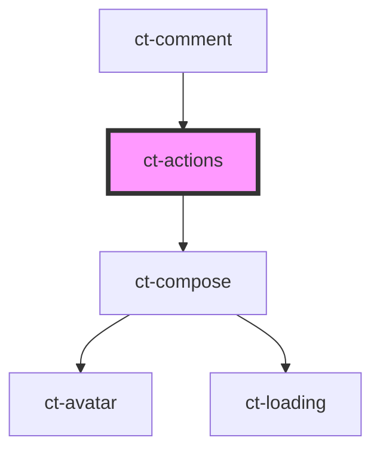

# ct-actions

<!-- Auto Generated Below -->

## Properties

| Property  | Attribute | Description | Type  | Default     |
| --------- | --------- | ----------- | ----- | ----------- |
| `comment` | `comment` |             | `any` | `undefined` |

## Dependencies

### Used by

 - [ct-comment](../comment)

### Depends on

- [ct-compose](../compose)

### Graph

----------------------------------------------

*Built with [StencilJS](https://stenciljs.com/)*
