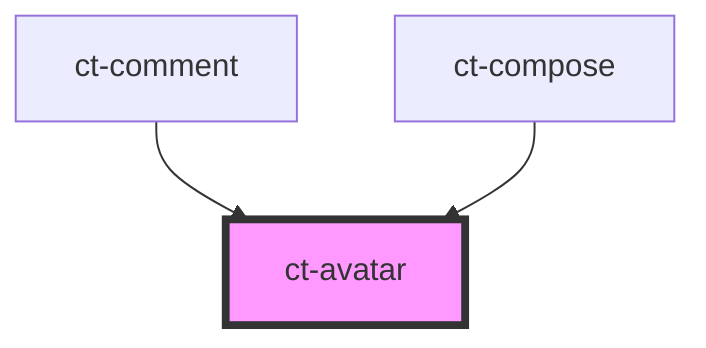

# ct-avatar

<!-- Auto Generated Below -->

## Properties

| Property  | Attribute  | Description | Type      | Default     |
| --------- | ---------- | ----------- | --------- | ----------- |
| `isSmall` | `is-small` |             | `boolean` | `false`     |
| `user`    | `user`     |             | `any`     | `undefined` |

## Dependencies

### Used by

 - [ct-comment](../comment)
 - [ct-compose](../compose)

### Graph

----------------------------------------------

*Built with [StencilJS](https://stenciljs.com/)*
