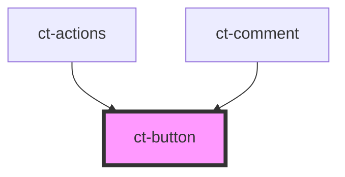

# ct-button

<!-- Auto Generated Below -->

## Properties

| Property | Attribute | Description | Type      | Default |
| -------- | --------- | ----------- | --------- | ------- |
| `active` | `active`  |             | `boolean` | `false` |
| `small`  | `small`   |             | `boolean` | `false` |

## Dependencies

### Used by

 - [ct-actions](../actions)
 - [ct-comment](../comment)

### Graph

----------------------------------------------

*Built with [StencilJS](https://stenciljs.com/)*
