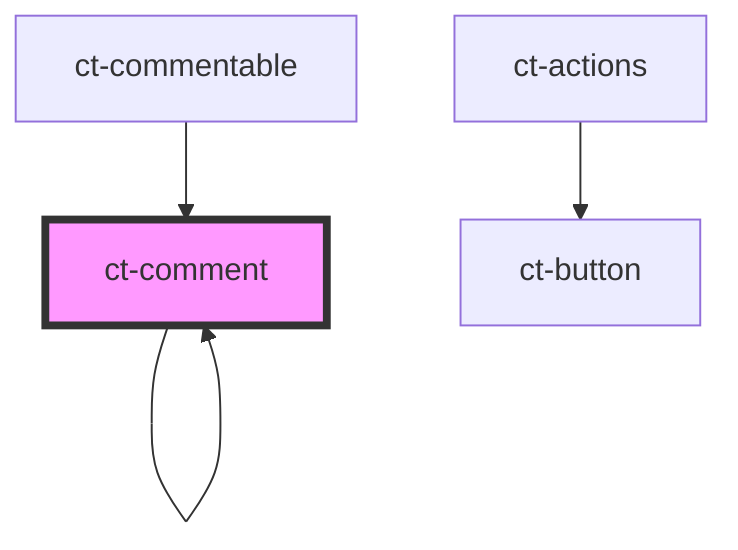

# ct-comment

<!-- Auto Generated Below -->

## Properties

| Property        | Attribute        | Description | Type      | Default     |
| --------------- | ---------------- | ----------- | --------- | ----------- |
| `comment`       | `comment`        |             | `any`     | `undefined` |
| `commentableId` | `commentable-id` |             | `string`  | `undefined` |
| `config`        | `config`         |             | `any`     | `undefined` |
| `nested`        | `nested`         |             | `boolean` | `false`     |

## Dependencies

### Used by

 - [ct-comment]()
 - [ct-commentable](../commentable)

### Depends on

- [ct-avatar](../avatar)
- [ct-actions](../actions)
- [ct-button](../button)
- [ct-comment]()

### Graph

----------------------------------------------

*Built with [StencilJS](https://stenciljs.com/)*
