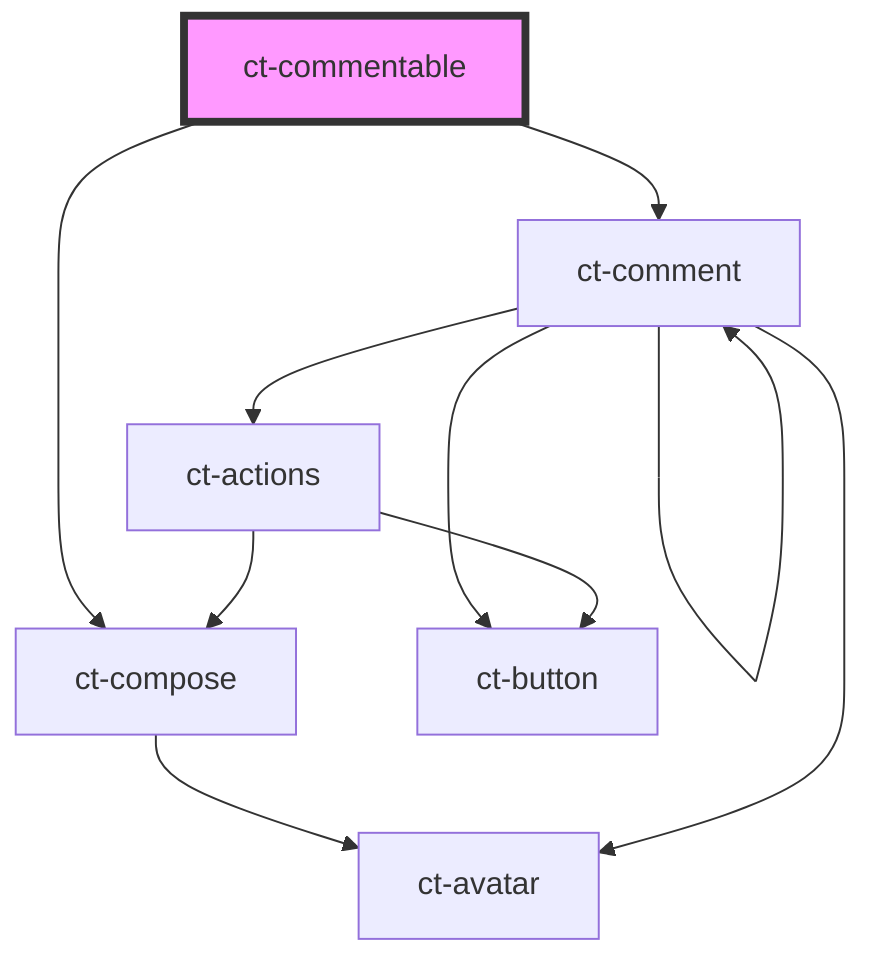

# commentable-section

<!-- Auto Generated Below -->

## Properties

| Property        | Attribute         | Description | Type     | Default     |
| --------------- | ----------------- | ----------- | -------- | ----------- |
| `apiUrl`        | `api-url`         |             | `string` | `undefined` |
| `commentableId` | `commentable-id`  |             | `string` | `undefined` |
| `config`        | `config`          |             | `any`    | `undefined` |
| `googleIdToken` | `google-id-token` |             | `string` | `undefined` |
| `primaryColor`  | `primary-color`   |             | `string` | `undefined` |

## Dependencies

### Depends on

- [ct-compose](../compose)
- [ct-comment](../comment)

### Graph

----------------------------------------------

*Built with [StencilJS](https://stenciljs.com/)*
