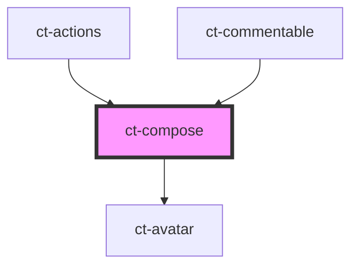

# ct-compose

<!-- Auto Generated Below -->

## Properties

| Property        | Attribute        | Description | Type     | Default     |
| --------------- | ---------------- | ----------- | -------- | ----------- |
| `apiUrl`        | `api-url`        |             | `string` | `undefined` |
| `comment`       | `comment`        |             | `any`    | `undefined` |
| `commentableId` | `commentable-id` |             | `string` | `undefined` |

## Dependencies

### Used by

 - [ct-actions](../actions)
 - [ct-commentable](../commentable)

### Depends on

- [ct-avatar](../avatar)

### Graph

----------------------------------------------

*Built with [StencilJS](https://stenciljs.com/)*
